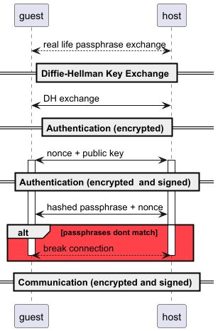
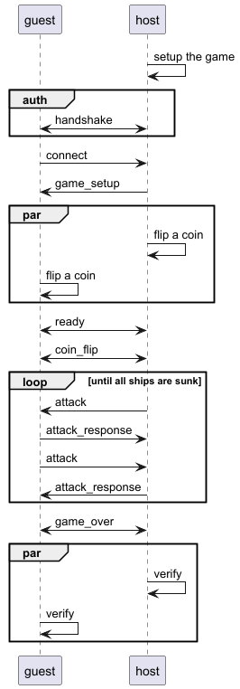

# Battleship P2P Protocol

### Version 1.0

# Table of Contents

1. [Introduction](#Introduction)
2. [Security](#Security)
3. [Game](#Game)
4. [Messages](#Messages)

## Introduction

This protocol is an attempt to create a reasonably secure and reliable
p2p protocol to play the game Battleship.

## Security

#### Handshake

1. The host defines a passphrase and shares it with the guest over
   some, preferably secure, alterrnative channel.
2. The host opens the TCP connection.
3. The guest initiates a Diffie-Hellman key exchange with the host.
    * DH parameters are
      the [group #15](https://www.rfc-editor.org/rfc/rfc3526#section-4)
    * the resulting prime must be hashed with SHA-256, and the first
      64 bytes constitute the **symmetric key**
4. from now on the all the communication must:
    * be encrypted with the **symmetric key**
        * Algorithm: AES/GCM/NoPadding
        * IV: Randomly generated and sent to the guest
5. The host and the guest exchange their public keys and the one-time
   randomized value (**nonce**)
6. from now on the all the communication must:
    * have a sequence number assigned to them
    * be signed with the **private key**
        * algorithm: SHA256 with RSA
7. The host and the guest hash the combine the **passphrase and the
   nonce** hash the result using **SHA-256** and send it to each
   other.
8. guest and host verify that the hash received from the other matches
   the one they calculated, if not they must terminate the connection.



#### Types

##### Diffie-Hellman Payload

```json
{
  "publicValue": "string"
}
```

##### Public Key Nonce Payload

```json
{
  "publicKey": "string",
  "nonce": "string"
}
```

##### Encrypted Payload

```json
{
  "payload": "encrypted payload content",
  "iv": "srting"
}
```

##### Signed Payload

```json
{
  "payload": "any",
  "sequence": "int",
  "signature": "sha-256 hash of payload and sequence (string)"
}
```

##### Authentication Payload

```json
{
  "challenge": "string"
}
```

## Game

this paragraph describes the game setup and the game loop.

### Game Setup

After the guest connects and the host accepts the connection, the
guest sends the **Connect** message, and the host responds with the
**Game Setup** message

### Board

The Board is represented as an **N** by **M** 2D array of characters
following the schema:

| Ship Type  | Cell Value | Ship Size |
|:-----------|:-----------|-----------|
| Carrier    | C          | 5         |
| Battleship | B          | 4         |
| Frigate    | F          | 3         |
| Destroyer  | D          | 2         |
| Submarine  | S          | 1         |
| Empty Cell | E          | 0         |

The Game follow the common
Battleship [rules](https://en.wikipedia.org/wiki/Battleship_(game))

### Move Order

The host and the guest both "flip a coin" (rnd true or false), if the
values Match the guest moves first, otherwise the host moves first.

### Cheat Prevention

For integrity the board must be converted to a 1D projection String,
append the guessed value to the end of the String (separated by a
semicolon), and hash it with SHA-256. This hash will be sent to the
Opponent with the **Ready** message. At the end of the game, both
boards will be exchanged with a "Game Over" message, and both players
can reconstruct the string hash it and compare it to the received
hash.

#### Example

**4x4 board with 2 ships:**\
E E E E\
B B B B &#8594; EEEEBBBBSESE \
S E S E\
**guess: true**\
**final string:** EEEEEBBBBSESE;true

#### Game Loop

After the guest and the host have **both** sent and received the
"Ready" are messages, they have to send their coin flips as the "Coin
Flip"
message. After
both players are aware of the move order,
the game starts by sending the "Attack" messages back and forth,
always
awaiting the "Attack Response".
If a hit is the final one, the player still has to response with the
"Attack Response" but also follow it with the "Game Over" message. The
opponent also has to respond with a "Game Over message" to make sure
the Player can still verify the game state.



### Messages

#### Message Types and Description

| Message Type        | Message Content | Description                                                   |
|:--------------------|:----------------|:--------------------------------------------------------------|
| **connect**         | Connection      | Establish a connection with the opponent                      |
| **game_setup_data** | Game Setup      | Send the game setup data to the opponent                      |
| **ready**           | Ready           | Indicate that the player is ready to start the game           |
| **coin_flip**       | Coin Flip       | Sends the result of the coin flip to determine who goes first |
| **attack**          | Attack          | Send an attack coordinate to the opponent                     |
| **attack_response** | Attack Response | Hit, Miss, or Sink depending on the opponent's move           |
| **game_over**       | Game Over       | Indicate that the game is over                                |
| **error**           | Error Message   | Indicate an error has occurred                                |

### Error Types

1. wrong_turn: Indicate that it is not the player's turn
2. invalid_move: Indicate that the move is invalid (out of bounds,
   double tap, etc.)
3. game_already_over: Indicate that the game is already over and no
   more moves can be made
4. invalid_signature: Indicate that the signature is invalid
5. invalid_challenge: Indicate that the challenge is invalid
6. invalid_game_state: Indicate received game_setup_hash was invalid
7. unknown_message: Indicate that the message type is unknown

### Types

##### Base Message

```json
{
  "type": "string",
  "payload": "any"
}
```

##### Connection

```json
{
  "user": "userName"
}
```

##### Game Setup

```json
{
  "columns": "int",
  "rows": "int",
  "host": "User"
}
```

##### Ready

```json
{
  "integrityHash": "string"
}
```

##### Ready

```json
{
  "coinFlip": "boolean"
}
```

##### Attack

```json
{
  "column": "int",
  "row": "int"
}
```

##### Attack Response

```json
{
  "attackStatus": "hit | miss | sink"
}
```

##### Game Over

```json
{
  "won": "boolean",
  "board": "string"
}
```

##### Error Message

```json
{
  "errorType": "string",
  "errorMessage": "string"
}
```